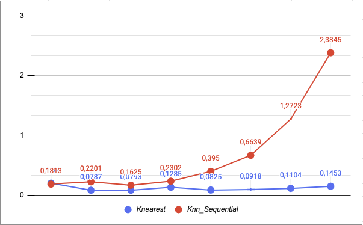

# ProyectoIII_BDII

## Integrantes

| Nombre y Apellidos | Código de alumno |
|-|-|
|Johan Tanta Villanueva | 201810605 |
|Jorge Nicho Galagarza	| 201810205 |
|Andres Riveros Soto    | 201810017 |


#### Ejecución del programa
Dirigirse a la carpeta ang-node/ y ejecutar el siguiente comando: `sh run.sh`

## Introducción
En este presente proyecto, se implementó una base de datos multimedia de imágenes. Asimismo, se utilizó una gran colección con más de 13 mil imágenes de rostros de personas, obtenidos en la [página](http://vis-www.cs.umass.edu/lfw/) de University of Massachusetts. Para la indexación eficiente de las imágenes se utilizó el R-tree como estructura de datos. Además, se utilizó la librería [Face Recognition](https://face-recognition.readthedocs.io/en/latest/readme.html) de python la cual nos brinda los vectores carácteristicos de los rostros que se identifica en la imagen.

##  Frontend
Se elaboró un motor de búsqueda en el se visualiza un buscador y una tabla de resultados JSON, que representa las imagenes similares.

### Integración con NodeJS y Angular

* server.js

El server recibe un archivo y lo envia al index.html para hacer mostrar una lista de imagenes JSON. En caso se ingrese una palabra simple o compuesta al buscador, este hará un POST y le mandará la palabra ingresada al archivo Python para realizar la lógica de la búsqueda.

```
var bodyParser = require('body-parser');
var urlencodedParser = bodyParser.urlencoded({extended: false});

app.use(express.static(path.join(__dirname, 'dist/ang-node')));

app.use('/routes', routes);

app.get('/posts', (req, res)=>{
    res.sendFile(path.join(__dirname, 'dist/ang-node/index.html'))
})

const sleep = (n) => new Promise((res) => setTimeout(res, n));

async function start(){
    await sleep(5000);
}

app.get('/send', (req, res)=>{
    start();
    console.log("send completed")
    res.sendFile(path.join(__dirname, 'dist/ang-node/index.html'))
});

app.post('/send/submit', urlencodedParser, function(req, res){
    const obj = req.body;
    console.log(obj.word)
    const spawn = require('child_process').spawn;
    const process = spawn('python', ['./src/pythonCode/search.py', obj.word]);

    process.stdout.on('data', data => {
        console.log("dentro");
        res.redirect('/send');
    }).on('end', function() {
        console.log("python completed")
        res.redirect('/send');
    });
});

const port = process.env.PORT || 4600;

app.listen(port, (req, res)=>{
    console.log(`RUNNING on port ${port}`);
})
```

* routes.js

Recibimos el archivo JSON y lo enviamos al frontend a partir de un router tanto para la lista de JSON inicial como para el resultado de la búsqueda.

```
router.get('/posts', (req, res)=>{
    const data = JSON.parse(fs.readFileSync('./src/pythonCode/initial_db.json'));
    res.json(data);
})

router.get('/send', (req, res)=>{
    const newData = JSON.parse(fs.readFileSync('./src/pythonCode/result_db.json'));
    //res.json(newData);
    res.json(newData);
})
```

* posts.service.ts

Usamos un service que hará un request al server de todas las imagenes y las injectará en el frontend.

```
export class PostsService {

  constructor(private http: HttpClient) { }

  getAllPosts() {
    return this.http.get('/routes/posts/').pipe(map((posts) => {
      return posts;
    }));
  }
}
```

* posts.component.ts

Cuando nuestro componente es iniciatizado, vamos a usar el método de nuestro service para recibir todas las imagenes y almacenarlas en nuestro array posts.

```
export class PostsComponent implements OnInit {

  posts: any = [];

  constructor(private postService: PostsService) { }

  ngOnInit() {
    this.postService.getAllPosts().subscribe(posts => {
        this.posts = posts;
    });
  }

}
```

* send.service.ts

Usamos un service que hará un request al server de imagenes recuperadas a partir del input y los injectará en el frontend.

```
export class SendService {

  constructor(private http: HttpClient) { }

  getAllPosts() {
    return this.http.get('/routes/send/').pipe(map((posts) => {
      return posts;
    }));
  }
}
```

* send.component.ts

Cuando nuestro componente es iniciatizado, vamos a usar el método de nuestro service para recibir todos las imagenes y almacenarlos en nuestro array send.

```
export class SendComponent implements OnInit {

  send: any = [];

  constructor(private sendService: SendService) { }

  ngOnInit() {
    this.sendService.getAllPosts().subscribe(send => {
        this.send = send;
    });
  }

}
```


* app.module.ts

Declaramos nuestro route y lo registramos.

```
const Routes = [
  {
    path: '',
    redirectTo: 'posts',
    pathMatch: 'full'
  },
  {
    path: 'posts', component: PostsComponent
  },
  {
    path: 'send', component: SendComponent
  }
];

@NgModule({
  declarations: [
    AppComponent,
    PostsComponent,
    SendComponent
  ],
  imports: [
    BrowserModule,
    HttpClientModule,
    RouterModule.forRoot(Routes)
  ],
  providers: [PostsService],
  bootstrap: [AppComponent]
})
export class AppModule { }
```

* posts.component.html && send.component.html

En una tabla del html, llamamos a cada elemento del JSON para que en cada fila imprima la imagen con mayor similitud hasta la que tiene menor similitud.

```
<div class="container mb-5">
    <form id="send-form" class="form-inline text-center" method="POST" action="/send/submit">
      <input class="form-control mr-3" name="word" type="text" placeholder="Search" aria-label="Search">
      <button class="btn btn-dark" type="submit">Buscar</button>
    </form>
</div>

<table class="table table-striped">
    <thead>
      <tr>
        <th scope="col">url</th>
      </tr>
    </thead>
    <tbody>
      <tr *ngFor="let post of posts">
        <td></td>
      </tr>
    </tbody>
  </table>
```
## Backend

## Face Recognition
Esta librería identifica los rostros y devuelve el vector característico de cada uno de ellos con las siguientes líneas de código.

```
import face_recognition
picture = face_recognition.load_image_file(image_path)
all_face_encodings = face_recognition.face_encodings(picture)
```
Asimismo, el tamaño del vector característico del rostro es 128.

## R-tree
Se utilizó la librería [RTree](https://rtree.readthedocs.io/en/latest/) la cual tiene implementado la estructurado de datos propuesta en el lenguaje de Python. Debido a que el tamaño del vector característico de los rostros es 128, ocasiona que la estructura de datos tenga una alta dimensionalidad lo cual reduce la eficiencia de la misma. Observamos que estamos en presencia con el problema de la **maldición de la dimensionalidad** que reduce el performance del R-tree. Para evitar que se degrade el performance de la estructura utilizamos una de las técnicas para reducir la dimensionalidad, en este caso nos apoyamos de **Principal Component Analysis** (PCA).

## PCA
Utilizamos la librería [scikit-learn](), la cual nos proporciona la clase [PCA](https://scikit-learn.org/stable/modules/generated/sklearn.decomposition.PCA.html) que se estaría encargando de reducir la dimensionalidad del dataset. Para ello, se procede a ejecutar los siguientes pasos:

* Obtener archivo .csv donde se guarde los vectores característicos de los rostros.
* Luego, se procede a estandarizar los datos con ayuda de la clase *StandardScaler*, proporcionada de la misma librería. Por dentro, elimina la media y escala los datos de forma que su varianza sea igual a 1.
```
from sklearn.preprocessing import StandardScaler
scaler = StandardScaler()
scaler.fit(x)
x_scaled = scaler.transform(x)
```
* Después, se instancia la clase *PCA* con parámetros con finalidad de reducir la dimensionalidad sin tener mucha pérdida de información y se entrena con nuestro dataset.
```
from sklearn.decomposition import PCA
pca = PCA(.99999, svd_solver ='full')
pca.fit(x_scaled)
ncomponents = len(pca.components_)
```
* Posteriormente, reducimos la dimensionalidad de nuestro dataset
```
x_pca = pca.transform(x_scaled)
```
* Finalmente, guardamos nuestro nuevo dataset y los modelos entrenados como el *PCA* y *StandardScaler*.

Este proceso se encuentra implementado en nuestro jupyter notebook **dimensionality_reduction.ipynb**.

## Base de datos
Luego de obtener el dataset final, creamos nuestro índice con la dimensionalidad final:
```
p = index.Property()
p.dimension = ncomponents
idx = index.Index(path, properties=p)
```
Finalmente, se inserta en nuestro R-tree como está indicado en la documentación:
```
idx.insert(i, point, obj=image)
```

Este proceso se encuentra implementado en nuestro jupyter notebook **creation_rtree.ipynb**.

### Parser de la imagen
Antes de responder la consulta sobre las imagenes con mayor similitud a partir de una. Se realizar un parseo al input, lo cual se apoya de los modelos entrenados que fueron guardados antes.
```
scaler = pickle.load(open(scaler_path, "rb"))
pca = pickle.load(open(pca_path, "rb"))
def parser_image(image_path):
    picture = face_recognition.load_image_file(image_path)    
    all_face_encodings = face_recognition.face_encodings(picture)
    x = generate_df(all_face_encodings)
    x_scaled = scaler.transform(x)
    x_pca = pca.transform(x_scaled)
    return x_pca[0]
```

## Pruebas Funcionales KNN Search

La finalidad de las pruebas es comparar el método `knearest` brindada por la misma clase R-tree con la implementación de una búsqueda secuencial de KNN apoyada de una cola de prioridad. Ambos se encuentran implementadas en el archivo search.py. 

Por un lado, para  la busqueda KNN-Rtree se va a cargar a disco el archivo Rtree_index.idx  con la ayuda de la libreria Rtree. Luego se hace la llamada al metodo `knearest` para encontrar los k mas cercanos, y luego en el archivo result_db.json se va a obtener la direccion de los fotos resultantes.

Por otro lado, la busqueda Knn Sequential, va a carga el archivo dataset_{size}.csv. Los objetos se van a introducir dentro un `min-heap` de tamaño k para obtener los k mas cercanos. 


Para las pruebas funcionales del KNN Search, la variable k tomó el valor de 8. Se hizo el testing para cada tamano de imagenes, luego se grafico los tiempos del KNN tree y KNN Sequential

| Test  | Size  |KNN - Rtree | KNN- Secuencial| 
| :------------ |:---------------:| -----:| ------:|
| 1 | 100 |  0.1969 seconds|  0.1813 seconds |
| 2 | 200 |  0.0787 seconds | 0.2201 seconds|
| 3 | 400 |  0.0793 seconds| 0.1625 seconds  |
| 4 | 800 |  0.1285 seconds |  0.2302 seconds |
| 5 | 1600 | 0.0825 seconds  |  0.395 seconds|
| 6 | 3200 | 0.0918 seconds| 0.6639 seconds |
| 7 | 6400 | 0.1104 seconds | 1.2723 seconds |
| 8 | 12800 | 0.1453 seconds | 2.3845 seconds|

### Gráfica



## Conclusiones

- La implementación del KNN secuencial obtiene los mismos resultados del método `knearest` del R-tree. 
- A pesar de implementar un KNN secuencial apoyada de una cola de prioridad, este tiene un menor performance a comparación del método `knearest`.
- A mayor cantidad de datos, el método `knearest` resulta ser mucho mejor por lo que tiene una gran escabalidad de datos. 
