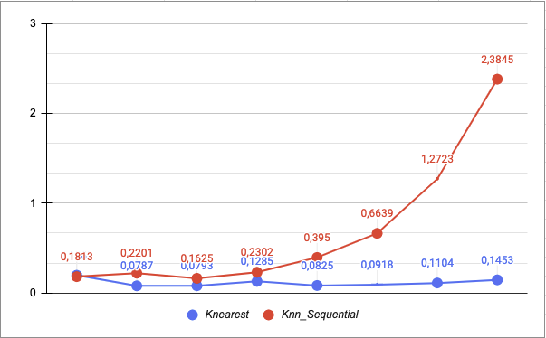

# ProyectoIII_BDII
## Integrantes

| Nombre y Apellidos | Código de alumno |
|-|-|
|Johan Tanta Villanueva |  |
|Jorge Nicho Galagarza	| 201810205 |
|Andres Riveros Soto    | 201810017 |


##  Frontend
Se elaboró un motor de búsqueda en el se visualiza un buscador y una tabla de resultados JSON, que representa las imagenes similares.

### Integración con NodeJS y Angular

* server.js

El server recibe un archivo y lo envia al index.html para hacer mostrar una lista de imagenes JSON. En caso se ingrese una palabra simple o compuesta al buscador, este hará un POST y le mandará la palabra ingresada al archivo Python para realizar la lógica de la búsqueda.

```
var bodyParser = require('body-parser');
var urlencodedParser = bodyParser.urlencoded({extended: false});

app.use(express.static(path.join(__dirname, 'dist/ang-node')));

app.use('/routes', routes);

app.get('/posts', (req, res)=>{
    res.sendFile(path.join(__dirname, 'dist/ang-node/index.html'))
})

const sleep = (n) => new Promise((res) => setTimeout(res, n));

async function start(){
    await sleep(5000);
}

app.get('/send', (req, res)=>{
    start();
    console.log("send completed")
    res.sendFile(path.join(__dirname, 'dist/ang-node/index.html'))
});

app.post('/send/submit', urlencodedParser, function(req, res){
    const obj = req.body;
    console.log(obj.word)
    const spawn = require('child_process').spawn;
    const process = spawn('python', ['./src/pythonCode/search.py', obj.word]);

    process.stdout.on('data', data => {
        console.log("dentro");
        res.redirect('/send');
    }).on('end', function() {
        console.log("python completed")
        res.redirect('/send');
    });
});

const port = process.env.PORT || 4600;

app.listen(port, (req, res)=>{
    console.log(`RUNNING on port ${port}`);
})
```

* routes.js

Recibimos el archivo JSON y lo enviamos al frontend a partir de un router tanto para la lista de JSON inicial como para el resultado de la búsqueda.

```
router.get('/posts', (req, res)=>{
    const data = JSON.parse(fs.readFileSync('./src/pythonCode/initial_db.json'));
    res.json(data);
})

router.get('/send', (req, res)=>{
    const newData = JSON.parse(fs.readFileSync('./src/pythonCode/result_db.json'));
    //res.json(newData);
    res.json(newData);
})
```

* posts.service.ts

Usamos un service que hará un request al server de todas las imagenes y las injectará en el frontend.

```
export class PostsService {

  constructor(private http: HttpClient) { }

  getAllPosts() {
    return this.http.get('/routes/posts/').pipe(map((posts) => {
      return posts;
    }));
  }
}
```

* posts.component.ts

Cuando nuestro componente es iniciatizado, vamos a usar el método de nuestro service para recibir todas las imagenes y almacenarlas en nuestro array posts.

```
export class PostsComponent implements OnInit {

  posts: any = [];

  constructor(private postService: PostsService) { }

  ngOnInit() {
    this.postService.getAllPosts().subscribe(posts => {
        this.posts = posts;
    });
  }

}
```

* send.service.ts

Usamos un service que hará un request al server de imagenes recuperadas a partir del input y los injectará en el frontend.

```
export class SendService {

  constructor(private http: HttpClient) { }

  getAllPosts() {
    return this.http.get('/routes/send/').pipe(map((posts) => {
      return posts;
    }));
  }
}
```

* send.component.ts

Cuando nuestro componente es iniciatizado, vamos a usar el método de nuestro service para recibir todos las imagenes y almacenarlos en nuestro array send.

```
export class SendComponent implements OnInit {

  send: any = [];

  constructor(private sendService: SendService) { }

  ngOnInit() {
    this.sendService.getAllPosts().subscribe(send => {
        this.send = send;
    });
  }

}
```


* app.module.ts

Declaramos nuestro route y lo registramos.

```
const Routes = [
  {
    path: '',
    redirectTo: 'posts',
    pathMatch: 'full'
  },
  {
    path: 'posts', component: PostsComponent
  },
  {
    path: 'send', component: SendComponent
  }
];

@NgModule({
  declarations: [
    AppComponent,
    PostsComponent,
    SendComponent
  ],
  imports: [
    BrowserModule,
    HttpClientModule,
    RouterModule.forRoot(Routes)
  ],
  providers: [PostsService],
  bootstrap: [AppComponent]
})
export class AppModule { }
```

* posts.component.html && send.component.html

En una tabla del html, llamamos a cada elemento del JSON para que en cada fila imprima la imagen con mayor similitud hasta la que tiene menor similitud.

```
<div class="container mb-5">
    <form id="send-form" class="form-inline text-center" method="POST" action="/send/submit">
      <input class="form-control mr-3" name="word" type="text" placeholder="Search" aria-label="Search">
      <button class="btn btn-dark" type="submit">Buscar</button>
    </form>
</div>

<table class="table table-striped">
    <thead>
      <tr>
        <th scope="col">url</th>
      </tr>
    </thead>
    <tbody>
      <tr *ngFor="let post of posts">
        <td></td>
      </tr>
    </tbody>
  </table>
```


## RTree

Con las ayuda de la libreria Rtree creamos los indices Rtree para cada muestra de fotos. El indexfile es creado desde creation_rtree.ipynb, va a generar el archivo rtree_index. Este archivo servira para cargar el Rtree a memoria al momento de realizar las búsquedas. 

## Sequential
Creamos dataset_{size}.csv para cierta cantidad de imágenes y se encuentra en la carpeta data. A través de estos archivos que contienen el vector característico y la dirección de la foto resultante generamos los rtree_index_{size}. 

## Pruebas Funcionales KNN Search

Se implemento dos tipos de funciones para la busqueda KNN, el primero es el KNN-sequential y el segundo es el Knn-Rtree. Ambas funciones se encuentran dentro del archivo search.py. 

Por un lado, para  la busqueda Knn-Rtree se va a cargar a disco el archivo Rtree_index.idx  con la ayuda de la libreria Rtree . Se va a llamar al metodo `nearest` para encontrar los k mas cercanos, y luego en el archivo result_db.json se va a obtener la direccion de los fotos resultantes.

Por otro lado , la busqueda Knn Sequential, va a carga el archivo dataset_{size}.csv. Los objetos se van a introducir dentro un `min-heap` de tamaño k para obtener los k mas cercanos. 


Para las pruebas funcionales del KNN Search, la variable k tomó el valor de 8 . Se hizo el testing para cada tamano de imagenes, luego se grafico los tiempos del KNN tree y KNN Sequential


| Test  | Size  |KNN - Rtree | KNN- Secuencial| 
| :------------ |:---------------:| -----:| ------:|
| 1 | 100 |  0.1969 seconds|  0.1813 seconds |
| 2 | 200 |  0.0787 seconds | 0.2201 seconds|
| 3 | 400 |  0.0793 seconds| 0.1625 seconds  |
| 4 | 800 |  0.1285 seconds |  0.2302 seconds |
| 5 | 1600 | 0.0825 seconds  |  0.395 seconds|
| 6 | 3200 | 0.0918 seconds| 0.6639 seconds |
| 7 | 6400 | 0.1104 seconds | 1.2723 seconds |
| 8 | 12800 | 0.1453 seconds | 2.3845 seconds|


